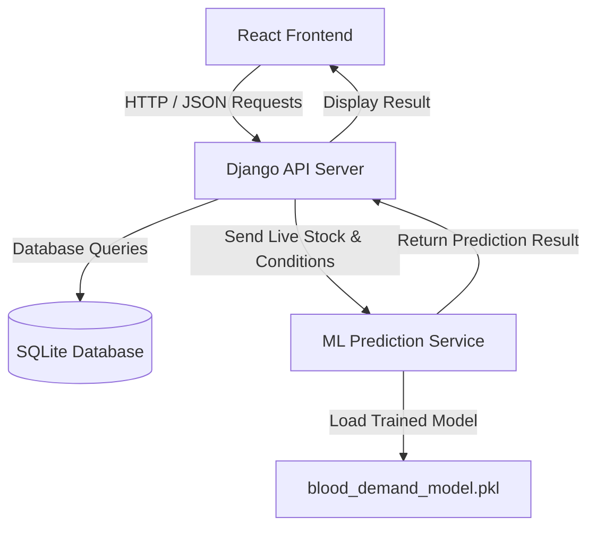
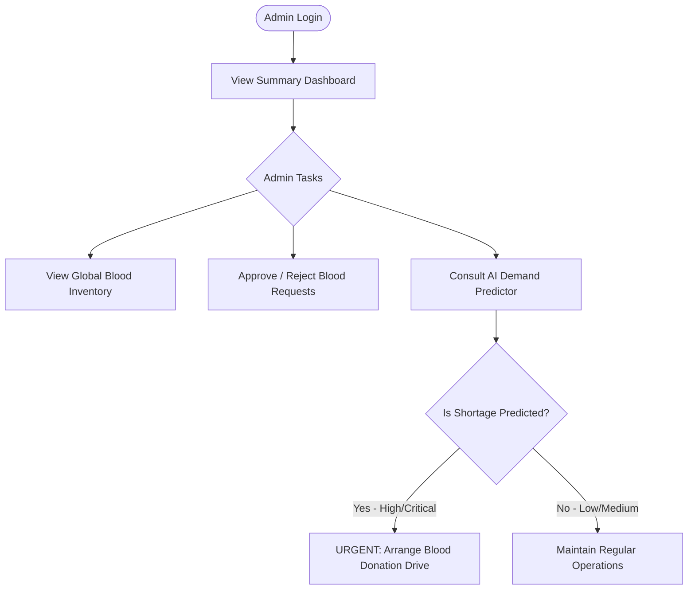
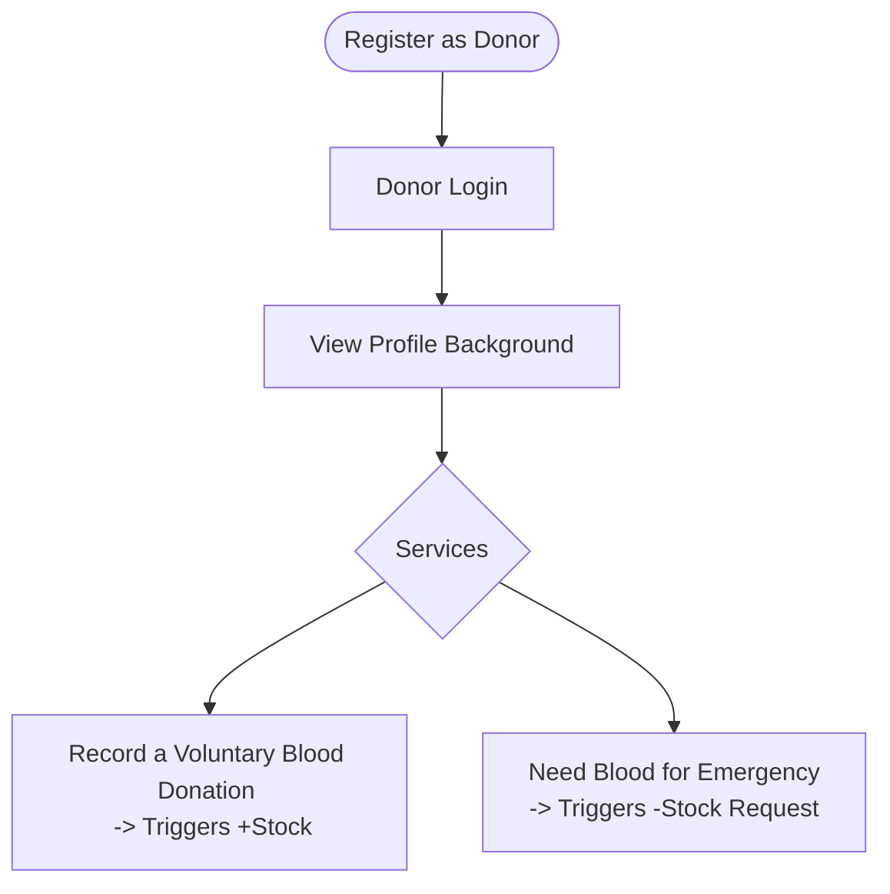

# 🩸 Blood Bank Management System with AI - Project Documentation

This document explains **why machine learning is used**, **what each file does**, and maps out the data flow with clear flowcharts. This is the perfect reference material for your B.Tech project report.

---

## 1. Why use Machine Learning (AI)?
Traditionally, Blood Banks operate on a **reactive** basis—they only realize they need blood when an emergency request comes in. At that point, it can be too late to organize a donation drive. On the other hand, overstocking blood is wasteful because red blood cells expire after ~42 days.

**Our AI Solution:** We introduced an **AI Predictor (Random Forest Classifier)** to make the system **proactive**.
- The AI looks at **historical and current factors**: Blood Group, Season (e.g., summer or monsoon), Location Type (rural vs urban), Current Stock, Recent Donations, and Recent Requests.
- The AI **predicts future demand**: It outputs `Low`, `Medium`, `High`, or `Critical`.
- **The Result**: If the artificial intelligence predicts an upcoming "Critical" shortage for `O+` blood during the monsoon in a rural area, the Admin knows to urgently organize targeted blood donation camps _before_ the shortage actually strikes and costs lives.

---

## 2. Project Architecture Flowchart

Below is a flowchart representing how the different technologies interact:

---

## 3. Directory Breakdown: "What file does what?"

### A. The Backend (Django REST Framework)
The backend acts as the brain that securely manages data and runs the AI.

*   [manage.py](file:///c:/Users/brahm/.gemini/antigravity/scratch/blood-bank-management/manage.py) — The core entry point for Django. You use this to run the server and migrate databases.
*   [db.sqlite3](file:///c:/Users/brahm/.gemini/antigravity/scratch/blood-bank-management/db.sqlite3) — The built-in relational database. It stores users, inventory, and requests.
*   [backend/settings.py](file:///c:/Users/brahm/.gemini/antigravity/scratch/blood-bank-management/backend/settings.py) — General configurations, including security keys, database connections, and paths to your [.pkl](file:///c:/Users/brahm/.gemini/antigravity/scratch/blood-bank-management/ml_service/label_encoder.pkl) ML models.
*   [backend/urls.py](file:///c:/Users/brahm/.gemini/antigravity/scratch/blood-bank-management/backend/urls.py) — The main routing hub. It directs frontend `/api/...` requests to the correct app (accounts, bloodbank, ml_service).

**The 3 Internal Django Apps:**
1.  **`accounts/`**: Manages users.
    *   [models.py](file:///c:/Users/brahm/.gemini/antigravity/scratch/blood-bank-management/ml_service/models.py): Defines the `CustomUser` (Admin vs Donor).
2.  **`bloodbank/`**: Manages all logic surrounding blood operations.
    *   [models.py](file:///c:/Users/brahm/.gemini/antigravity/scratch/blood-bank-management/ml_service/models.py): Maps Python classes to database tables (`BloodInventory`, `BloodDonation`, `BloodRequest`).
    *   [views.py](file:///c:/Users/brahm/.gemini/antigravity/scratch/blood-bank-management/ml_service/views.py): API handlers allowing React to fetch, create, update, or cancel blood requests/inventory.
3.  **`ml_service/`**: Houses the AI Logic.
    *   [train_model.py](file:///c:/Users/brahm/.gemini/antigravity/scratch/blood-bank-management/ml_service/train_model.py): **This is a highly important file!** Running this script generates 1,000 rows of synthetic historical data, trains a Python Scikit-Learn `RandomForestClassifier`, and tests its accuracy. Finally, it saves the "brain" of the model onto the disk.
    *   [blood_demand_model.pkl](file:///c:/Users/brahm/.gemini/antigravity/scratch/blood-bank-management/ml_service/blood_demand_model.pkl): The saved ("pickled") model file. This allows Django to load the fully trained model in milliseconds without re-training it every time someone clicks predict.
    *   [views.py](file:///c:/Users/brahm/.gemini/antigravity/scratch/blood-bank-management/ml_service/views.py): The API that React calls (`/api/ml/predict/`). It takes the user's frontend input, formats it using [label_encoder.pkl](file:///c:/Users/brahm/.gemini/antigravity/scratch/blood-bank-management/ml_service/label_encoder.pkl), asks [blood_demand_model.pkl](file:///c:/Users/brahm/.gemini/antigravity/scratch/blood-bank-management/ml_service/blood_demand_model.pkl) for an answer, and delivers it securely back to React.

### B. The Frontend (ReactJS) - `frontend/`
The visual interface built for both Administrators and Donors.

*   [src/index.js](file:///c:/Users/brahm/.gemini/antigravity/scratch/blood-bank-management/frontend/src/index.js) & [src/App.js](file:///c:/Users/brahm/.gemini/antigravity/scratch/blood-bank-management/frontend/src/App.js) — Initializes React and manages the Route navigation between pages.
*   [src/index.css](file:///c:/Users/brahm/.gemini/antigravity/scratch/blood-bank-management/frontend/src/index.css) & [src/App.css](file:///c:/Users/brahm/.gemini/antigravity/scratch/blood-bank-management/frontend/src/App.css) — Contains all the custom styling and design tokens used across the application.
*   [src/api/axios.js](file:///c:/Users/brahm/.gemini/antigravity/scratch/blood-bank-management/frontend/src/api/axios.js) — The module responsible for "networking." It automatically attaches security "bearer tokens" whenever the React app requests data from the Django API, ensuring only logged-in users get data.
*   **`src/pages/`**:
    *   [LoginPage.js](file:///c:/Users/brahm/.gemini/antigravity/scratch/blood-bank-management/frontend/src/pages/LoginPage.js) & [RegisterPage.js](file:///c:/Users/brahm/.gemini/antigravity/scratch/blood-bank-management/frontend/src/pages/RegisterPage.js) — User authentication and creation.
    *   [DashboardPage.js](file:///c:/Users/brahm/.gemini/antigravity/scratch/blood-bank-management/frontend/src/pages/DashboardPage.js) — A central visual hub showing summary statistics.
    *   [InventoryPage.js](file:///c:/Users/brahm/.gemini/antigravity/scratch/blood-bank-management/frontend/src/pages/InventoryPage.js) — A table displaying current blood units available in the system.
    *   [RequestsPage.js](file:///c:/Users/brahm/.gemini/antigravity/scratch/blood-bank-management/frontend/src/pages/RequestsPage.js) & [DonationsPage.js](file:///c:/Users/brahm/.gemini/antigravity/scratch/blood-bank-management/frontend/src/pages/DonationsPage.js) — Forms and lists for admins to approve/reject blood needs and stock.
    *   [MLPredictorPage.js](file:///c:/Users/brahm/.gemini/antigravity/scratch/blood-bank-management/frontend/src/pages/MLPredictorPage.js) — **The AI Interface**. A dedicated UI page where Admins can tweak sliders (e.g., current stock, requests last week) and click "Predict Demand" to visualize the AI's response in a beautifully styled card.

---

## 4. User Journey Flowcharts

### 🩸 Administrator Journey

### 🩸 Donor Journey

